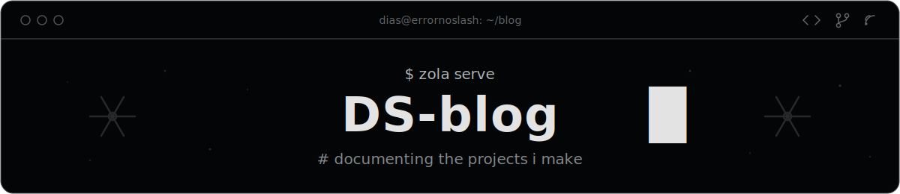

<p align="center">
  
</p>

# DS-blog

My personal blog, live at **[blog.errornoslash.be](https://blog.errornoslash.be)**. I made this to document the projects I make. The look matches my [portfolio](https://errornoslash.be): near-black, grey, monospace — nothing else.

## Stack

- [Zola](https://www.getzola.org) (0.22+) — static site generator, one binary, no runtime
- [Terminus](https://github.com/ebkalderon/terminus) theme, pulled in as a git submodule at `themes/terminus`
- A custom color scheme layered on top (see [Theming](#theming))
- Nix devshell for a reproducible environment

## Development

Clone with the theme submodule — without it Zola will refuse to build:

```bash
git clone --recurse-submodules <repo-url>
# or, if already cloned plain:
git submodule update --init
```

Enter the devshell and serve:

```bash
nix develop <flake>#zola   # provides zola
zola serve                 # live-reloads at http://127.0.0.1:1111
```

Production build:

```bash
zola build                 # output in public/
```

## Theming

Terminus routes every color through four CSS variables per scheme. Two custom schemes live in `static/css/custom-palette.css`:

| Scheme | Background | Text | Accent |
|---|---|---|---|
| `errorno-dark` (default) | `#040507` | `#AEB5B8` | `#e3e3e3` |
| `errorno-light` | `#AEB5B8` | `#2A2F32` | `#040507` |

The nav has a scheme picker (persisted in localStorage). Its scheme list is defined in `static/js/theme-switcher.js`, which **shadows the theme's copy** — Zola prefers same-path site files over theme files. If the submodule is updated (`git submodule update --remote themes/terminus`), diff the shadowed file against upstream in case the switcher script changed.

To adjust colors, edit the variables in `static/css/custom-palette.css`; scheme names there must match the keys in `theme-switcher.js` and `color_scheme` in `zola.toml`.

## Writing a post

Drop a Markdown file in `content/blog/`:

```markdown
+++
title = "post title"
date = 2026-07-21
[taxonomies]
tags = ["nix", "zola"]
+++

Post body here.
```

Tags and categories are configured in `zola.toml` (`taxonomies`); a tag page is generated per term, with its own feed.

## Layout

```
├── content/          # posts and pages (blog/, archive/, projects/)
├── static/
│   ├── css/custom-palette.css   # the two color schemes
│   └── js/theme-switcher.js     # shadowed switcher (two schemes only)
├── syntaxes/         # monokai-classic syntax highlighting theme
├── themes/terminus/  # theme (git submodule — do not edit in place)
├── assets/           # banner and repo assets (not published by Zola)
└── zola.toml         # site config
```
